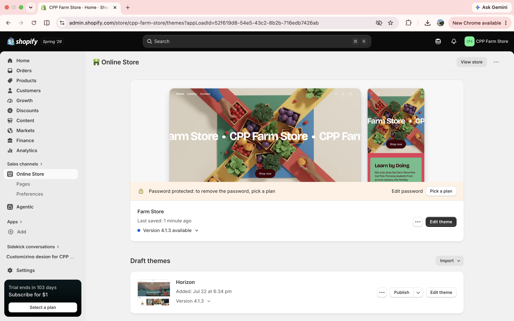
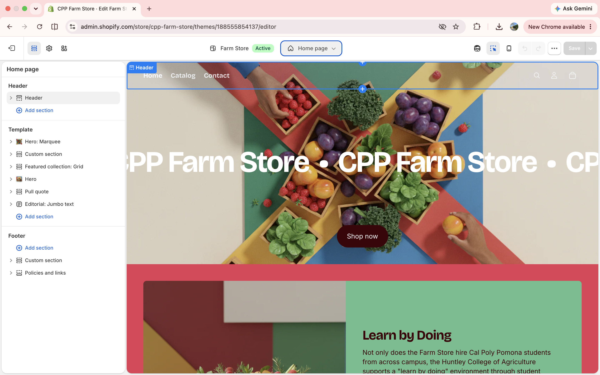

```{r}
#| label: setup
#| include: false
library(gt)
library(gtExtras)
```

# Introduction

This report introduces the concept for my practice Shopify store, **CPP Farm Store**, and documents the initial steps of setting the store up in Shopify. Rather than inventing a new concept, I chose to recreate the CPP Farm Store itself as my practice storefront, so that the setup decisions below feed directly into the retail questions we are exploring for the Farm Store consulting project[^1].

[^1]: This connection is expanded further in @sec-connection.

# Store Name and Concept

> "Fresh, Local, Bronco-Grown."\
> — CPP Farm Store brand tagline

**CPP Farm Store** (practice storefront) recreates the real Cal Poly Pomona Farm Store as a Shopify site, selling the same core mix of farm-fresh eggs, seasonal produce, plants, and local artisan goods that the physical store carries. The concept gives shoppers who already know the Farm Store an online option to browse and reorder the same products they'd find on campus.

::: callout-note
## Why recreate an existing store

Using the actual CPP Farm Store as my practice concept means the Shopify decisions I make here (product mix, homepage layout, pricing tone) map one-to-one onto the real consulting project instead of a hypothetical spin-off. Anything I test in this practice store is directly transferable.
:::

# Target Customer

CPP Farm Store is built around three overlapping customer groups connected to the Cal Poly Pomona community:

- **Busy CPP students** who want affordable, fresh food options but don't always have time to visit the physical Farm Store during open hours.
- **Faculty, staff, and campus neighbors** in Pomona and the surrounding area who are already familiar with the Farm Store and want a convenient reorder option for regulars like eggs, honey, or seasonal produce.
- **Gift-driven shoppers**, especially around graduation season, Mother's Day, and move-in week, looking for small, local, plant-based gifts (succulents, garden starts, artisan jars).

```{r}
#| label: tbl-customer
#| tbl-cap: "Target customer snapshot for CPP Farm Store"
data.frame(
  Segment = c("Busy Students", "Faculty & Local Residents", "Gift Shoppers"),
  `Shopping Behavior` = c("Quick online orders, price-sensitive, campus pickup preferred",
                           "Repeat purchases of staple items, values local sourcing",
                           "Seasonal/occasional purchases, values presentation and story"),
  check.names = FALSE
) |>
  gt() |>
  gt_theme_538()
```

As shown in @tbl-customer, each segment shops for a different reason, which shapes both the product mix and the homepage messaging described later in this report.

# Product Category Plan

CPP Farm Store will launch with five core product categories:

```{r}
#| label: tbl-categories
#| tbl-cap: "Initial product category plan"
data.frame(
  Category = c("Seasonal Produce Boxes", "Garden Starts & Succulents",
               "Local Artisan Pantry Goods", "Farm-Fresh Eggs & Dairy",
               "Bronco Farm Merchandise"),
  `Example Items` = c("Mixed veggie box, fruit box, salad box",
                       "Succulents, herb starts, potted seedlings",
                       "Local honey, jam, granola",
                       "Eggs, milk, cheese from partner suppliers",
                       "Totes, mugs, apparel with Farm Store branding"),
  check.names = FALSE
) |>
  gt() |>
  gt_theme_538()
```

::: callout-tip
## Category rationale

The first three categories map directly to what customers said they valued most on our Farm Store field trip: freshness, plants, and local goods. The last two rounded out the plan by adding a repeat-purchase staple (eggs/dairy) and a low-cost, high-margin merchandise line.
:::

# Initial Shopify Setup Evidence

::: panel-tabset
## Shopify Admin



## Selected Theme


## Homepage Draft


:::


# Connection to the Consulting Project {#sec-connection}

Building this practice store as a direct recreation of the CPP Farm Store gave me a hands-on way to work through several decisions I will need for the actual consulting project, since I am responsible for the Retailer Background Information and Current Retailing Strategy Methods sections of that deliverable. Choosing the target customer and product mix here is not a hypothetical exercise; it forced me to practice the exact task the Farm Store needs from us, matching product categories to who actually shops there, rather than starting from the products first. Setting up the Shopify theme and homepage also made me more aware of how much a store's *online* presentation communicates about its identity, which is directly relevant if the Farm Store consulting recommendations end up touching on omnichannel or e-commerce strategy. In short, this practice store is a low-risk sandbox for testing retail logic before applying it to the real client.

# Appendix

- GitHub Repository:https://github.com/daisyxhernandez20-oss/ITP-W04-Shopify-Store 
- GitHub Pages Site: https://daisyxhernandez20-oss.github.io/ITP-W04-Shopify-Store/

